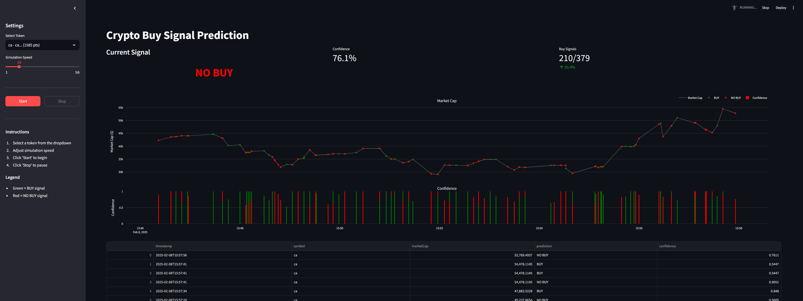
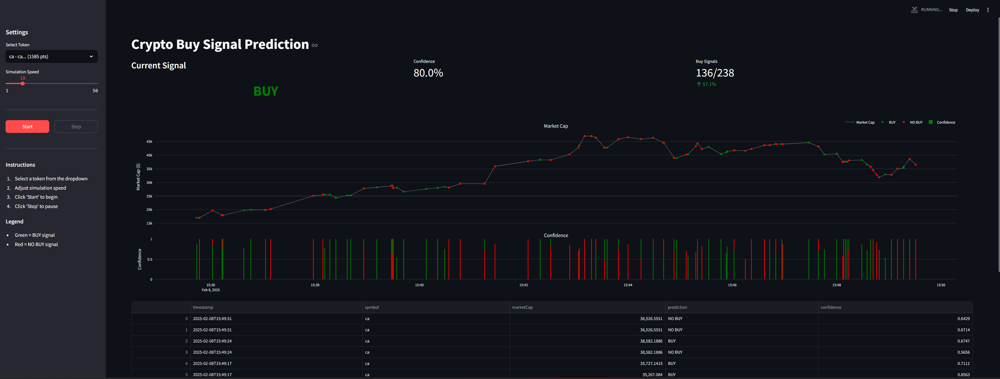

# Crypto Meme Coins Bot s XGBoost

## Přehled
Tento projekt je obchodní bot založený na strojovém učení, který využívá XGBoost, výkonný algoritmus gradientního boostingu,
k identifikaci potenciálních příležitostí k nákupu/prodeji meme coinů na základě tržních trendů a technických indikátorů.

Kryptoměny lze obecně rozdělit do tří kategorií podle tržní kapitalizace:

- **Large-cap coiny** (např. BTC, ETH) – Zavedené, nižší volatilita.
- **Mid-cap coiny** – Vznikající projekty se střední mírou rizika a výnosů.
- **Meme coiny & small-cap coiny** (např. DOGE, SHIB, PEPE) – Vysoká volatilita, spekulativní a často řízené komunitním hype.

Tento bot se zaměřuje na meme coiny a aplikuje strojové učení k identifikaci potenciálních signálů k prodeji/nákupu na základě kolísání trhu, technických indikátorů a minulých trendů.

## Proč XGBoost?
Zpočátku jsem experimentoval s neuronovou sítí pro predikci příležitostí k nákupu a prodeji. Nicméně jsem narazil na dva klíčové problémy:
- **Dataset nebyl dostatečně "obtížný"** – Pohyby cen meme coinů jsou sice velmi volatilní, ale často sledují jednodušší vzory, které nevyžadují hluboké učení.
- **Neuronové sítě měly problémy najít jasné vzory** – Síť nedokázala konzistentně rozpoznat signály k nákupu/prodeji,
pravděpodobně kvůli nedostatku hlubokých interakcí mezi features, které by odůvodnily složitější model.

---

## PyTorch Experiment (Work in Progress)

V rámci učení PyTorch frameworku probíhá reimplementace buy modelu pomocí neuronové sítě.

### Aktuální stav

| Komponenta | Status |
|------------|--------|
| Data pipeline | Hotovo |
| Custom Dataset & DataLoader | Hotovo |
| Feedforward Neural Network | Hotovo |
| TimeSeriesSplit | Hotovo |
| SMOTE | Hotovo |
| PR Curve analýza | Hotovo |
| Výkonnost modelu | Vyžaduje zlepšení |

### Aktuální výsledky (TimeSeriesSplit - férové porovnání)

| Metrika | XGBoost | PyTorch | Vítěz |
|---------|---------|---------|-------|
| **Average Precision** | 0.193 | 0.168 | XGBoost +15% |
| **F1 Score (Buy)** | 0.44 | 0.29 | XGBoost +52% |
| **Recall (Buy)** | 0.52 | 0.24 | XGBoost 2x lepší |
| **Precision (Buy)** | 0.38 | 0.35 | XGBoost |

**Závěr:** XGBoost výrazně překonává PyTorch neuronovou síť na tomto datasetu.

### Možné směry zlepšení PyTorch modelu
- Focal Loss pro nevyvážená data
- Class weights
- Lepší feature engineering
- Úprava labeling strategie

### Soubory

- `pytorch.ipynb` - Hlavní notebook s PyTorch implementací


---

## Upozornění

Tento projekt je **proof of concept** a je určen **pouze pro vzdělávací a výzkumné účely**.
**Nejedná se o finanční poradenství**, investiční doporučení nebo obchodní signály.
Minulá výkonnost **není** indikací budoucích výsledků.

**Používejte tento projekt na vlastní riziko.**

---

## Web Aplikace (FastAPI + Streamlit)

Projekt obsahuje webovou aplikaci pro vizualizaci a simulaci predikcí v reálném čase.

### Screenshots





### Architektura

```
┌─────────────────┐     HTTP      ┌─────────────────┐
│   Streamlit     │ ◄──────────► │    FastAPI      │
│   (Frontend)    │   /predict    │   (Backend)     │
│   port 8501     │   /simulate   │   port 8000     │
└─────────────────┘               └─────────────────┘
                                          │
                                          ▼
                                  ┌─────────────────┐
                                  │  XGBoost Model  │
                                  │  + Test Data    │
                                  └─────────────────┘
```

### Instalace

```bash
pip install -r requirements.txt
```

### Spuštění

**1. Spusťte FastAPI backend (v jednom terminálu):**

```bash
uvicorn api.main:app --reload --port 8000
```

**2. Spusťte Streamlit frontend (v druhém terminálu):**

```bash
streamlit run frontend/app.py
```

**3. Otevřete prohlížeč:**
- Frontend: http://localhost:8501
- API dokumentace: http://localhost:8000/docs

### API Endpointy

| Endpoint | Metoda | Popis |
|----------|--------|-------|
| `GET /` | GET | Health check |
| `POST /predict` | POST | Predikce pro jeden vzorek |
| `GET /simulate` | GET | SSE stream simulace |
| `GET /tokens` | GET | Seznam dostupných tokenů |
| `GET /token/{mint}` | GET | Detaily tokenu |

### Funkce

- **Real-time simulace** - Procházení historických dat s predikcemi modelu
- **Interaktivní grafy** - Vizualizace market cap a predikcí pomocí Plotly
- **BUY/NO BUY signály** - Barevné indikátory pro snadnou orientaci
- **Confidence meter** - Zobrazení jistoty modelu
- **Výběr tokenů** - Možnost simulovat různé tokeny z datasetu
